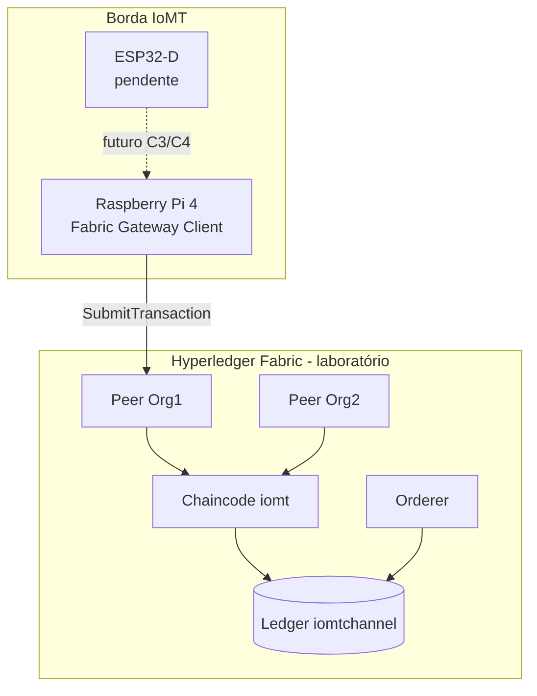

# Arquitetura experimental

> **Fase F2** — alinhada a F1 (`decisoes-stack.md`). Hardware atual: **apenas Raspberry Pi 4**.

## Visão geral

## Topologia Fabric (baseline)

| Componente | Quantidade | Função |
|------------|------------|--------|
| Orderer (Raft) | 1 | Ordenação em `iomtchannel` |
| Peer Org1 | 1 | Endorsement |
| Peer Org2 | 1 | Endorsement |
| CA | 1 | Identidades de laboratório |
| Canal | `iomtchannel` | Isolamento IoMT |

Base: **Fabric test-network** (2 orgs, 1 channel).

## Fluxo de dados (fase atual — Pi)

1. Origem: fixture FHIR ou, futuramente, stream MIMIC-IV.
2. Pi monta payload (`observationId`, `payloadHash`, `deviceId`, timestamp).
3. **Fabric Gateway** submete transação ao chaincode `iomt`.
4. Peers endorsam (ECDSA na baseline).
5. Orderer commita; Pi mede latência E2E.

## Cenários experimentais

| ID | Rede | Dispositivo | Fase atual |
|----|------|-------------|------------|
| C1 | ECDSA | Pi | **Implementar** |
| C2 | ML-DSA | Pi | Após Pilar 2 |
| C3 | ECDSA | ESP32 | Hardware pendente |
| C4 | ML-DSA | ESP32 | Hardware pendente |

Detalhes: [cenarios-experimentais.md](../.cursor/context/cenarios-experimentais.md).

## Paridade baseline ↔ ML-DSA

Mesma topologia, mesmo chaincode, mesma carga `hospital-low` / `hospital-high`.  
Alterar apenas: build BCCSP / perfil `fabric/mldsa`.

## Métricas (por transação)

- `t_submit` → `t_committed` (latência E2E)
- Tamanho do proposal e da assinatura endorser
- CPU% e RAM no Pi (`edge/raspberry-pi/scripts/collect_metrics.sh`)

## ESP32 (planejado)

Ordem de `signing_mode`: `esp32_direct` → `esp32_payload_only` → `esp32_gateway` (último recurso).

Não bloqueia validação de C1 no Pi.
