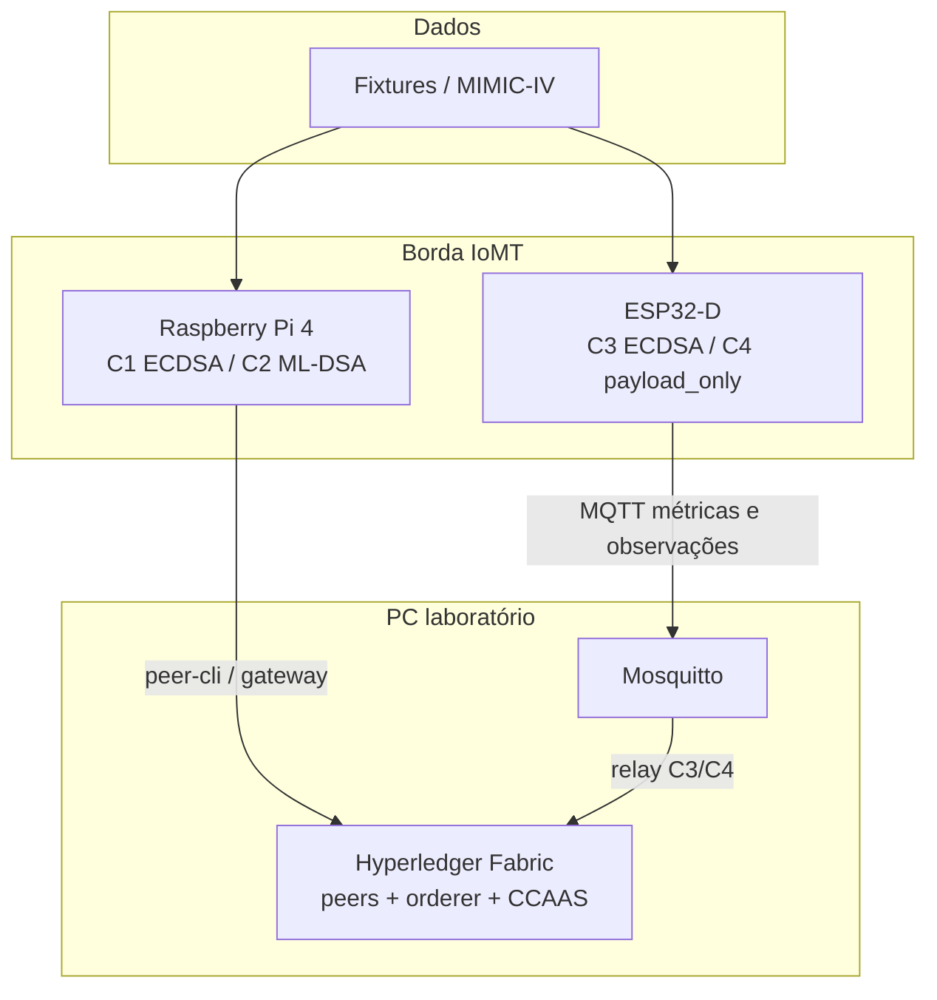

# Arquitetura experimental

Topologia do TCC: borda IoMT (Pi + ESP32), rede Hyperledger Fabric permissionada e ingestão FHIR.

## Visão geral

## Topologia Fabric

| Componente | Quantidade | Função |
|------------|------------|--------|
| Orderer (Raft) | 1 | Ordenação em `iomtchannel` |
| Peer Org1 / Org2 | 1 cada | Endorsement |
| CA | 1 | Identidades de laboratório |
| Chaincode `iomt` | CCAAS | `RegisterObservation`, `RegisterFhirObservation` |

Base: **Fabric test-network** (2 orgs, 1 canal). Perfis: `fabric/baseline` (ECDSA) e `fabric/mldsa` (BCCSP ML-DSA nos peers).

## Fluxo Raspberry Pi (C1 / C2)

1. Origem: fixture FHIR ou stream MIMIC-IV (credenciado).
2. Montagem do payload (`observationId`, hash FHIR, `deviceId`, timestamp, `signAlg`, assinatura da borda).
3. Submissão via **peer-cli** (dois endossos) ou Fabric Gateway.
4. Endorsement e commit; medição de latência E2E e recursos (`collect_metrics.sh`, benchmarks).

## Fluxo ESP32 (C3 / C4)

1. Firmware publica métricas e observações em tópicos MQTT (`iomt/esp32/{device_id}/...`).
2. **C3:** assinatura ECDSA-P256 no dispositivo (`esp32_direct`); relay submete ao Fabric.
3. **C4:** tentativa ML-DSA on-device falha de forma reproduzível; medição em **`esp32_payload_only`** (relay + submissão no host).
4. Benchmarks: `run-esp32-benchmark.sh` com `MQTT_HOST` definido.

Detalhes: [edge/esp32/docs/PONTE-MQTT-FABRIC.md](../edge/esp32/docs/PONTE-MQTT-FABRIC.md).

## Cenários na arquitetura

| ID | Rede | Dispositivo | Ponto de assinatura medido |
|----|------|-------------|----------------------------|
| C1 | baseline | Pi | ECDSA-P256 na borda |
| C2 | mldsa | Pi | ML-DSA-65 na borda |
| C3 | baseline | ESP32 | ECDSA no ESP32 |
| C4 | mldsa | ESP32 | Payload + relay (ML-DSA direto N/A) |

Especificação completa: [cenarios-experimentais.md](cenarios-experimentais.md).

## Paridade baseline ↔ ML-DSA

Mesma topologia de rede, mesmo chaincode, mesmas cargas `hospital-low` / `hospital-high`. Alterar apenas perfil de rede (`baseline` vs `mldsa`) e algoritmo de assinatura na borda. Regras: [paridade-experimental.md](paridade-experimental.md).

## Métricas

| Escopo | Métricas |
|--------|----------|
| Por transação | Latência E2E (média, p50, p95), TPS, bytes de assinatura/payload |
| Pi | CPU%, RAM (`resources.csv`) |
| ESP32 | Heap, resets, modo `signing_mode` em `metadata.json` |
| Opcional | Prometheus/Grafana (`monitoring/`) |

## Observabilidade (opcional)

Stack em `monitoring/`: node_exporter (Pi/PC), Telegraf (Docker + MQTT ESP32), Grafana com dashboard **IoMT — Monitoramento do laboratório**. Binds locais (`127.0.0.1`) no PC; MQTT na VLAN de laboratório.
