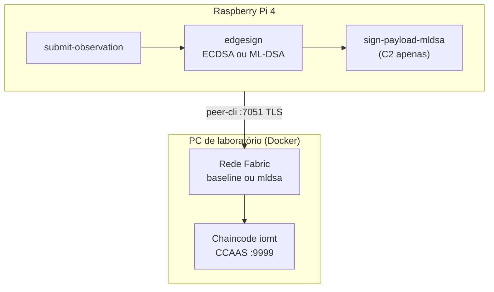

# Fluxo completo — cenários C1/C2 no Raspberry Pi 4

Guia operacional para executar cada cenário experimental com o cliente IoMT no Pi.  
Matriz completa (incluindo ESP32 C3/C4): `docs/cenarios-experimentais.md`.

## Visão geral



| Cenário | Rede no PC | Assinatura na **borda** (Pi) | Script smoke | `FABRIC_NETWORK` |
|---------|------------|------------------------------|--------------|------------------|
| **C1** | `fabric/baseline` | ECDSA-P256 | `smoke-c1.sh` | `baseline` |
| **C2** | `fabric/mldsa` | ML-DSA-65 (liboqs) | `smoke-c2.sh` | `mldsa` |
| **C3** | baseline | ESP32 (futuro) | — | — |
| **C4** | mldsa | ESP32 (futuro) | — | — |

O Pi **não** roda Docker Fabric: apenas o cliente (`peer` CLI + `submit-observation`).  
Peers, orderer e chaincode ficam no **PC** (`LAB_FABRIC_HOST`).

### Camadas de assinatura (TCC)

| Camada | C1 | C2 |
|--------|----|----|
| Borda (Pi) | ECDSA-P256 → ledger `signAlg` | ML-DSA-65 → ledger `signAlg` |
| Cliente Fabric (User1) | ECDSA (Fabric CA) | ECDSA (Fabric CA) |
| Peer (BCCSP) | ECDSA nativo | ML-DSA no binário peer |

Detalhes: `crypto/docs/p2-camadas-assinatura.md`.

---

## 1. Pré-requisitos

### No PC (host Fabric)

- Docker + rede Hyperledger Fabric 2.5
- Repositório clonado + `fabric-samples` (test-network com `organizations/`)
- Para **C2**: imagem `tcc/fabric-peer-mldsa:2.5.12` (ver `fabric/mldsa/README.md`)

### No Raspberry Pi

| Item | C1 | C2 |
|------|----|----|
| SSH acessível | Sim | Sim |
| `peer` ARM64 em `~/tcc-iomt/fabric-samples/bin/` | Instalado pelo deploy | Idem |
| Go + cmake + ninja | Opcional (deploy traz binários) | **Obrigatório na 1ª vez** (build liboqs no Pi) |
| `liboqs.so` | Não | `~/tcc-iomt/crypto/lib/lib/` |
| `/etc/hosts` com DNS Fabric | Sim | Sim |

### Rede

- Pi e PC na mesma LAN
- Firewall do PC: portas **7051**, **9051**, **7050** abertas para o Pi
- `LAB_FABRIC_HOST` = IP do PC na LAN (ex.: `192.168.0.10`)

---

## 2. Configuração única (PC)

### 2.1 Credenciais SSH

```bash
cd edge/raspberry-pi
cp lab.env.example lab.env
# Editar lab.env: PI_HOST, PI_USER, PI_SSH_PASSWORD, LAB_FABRIC_HOST
```

| Variável | Descrição |
|----------|-----------|
| `PI_HOST` | IP do Pi (ex. `192.168.0.100`) |
| `PI_USER` | Usuário SSH (ex. `pi4`) |
| `PI_SSH_PASSWORD` | Senha SSH (ou use `PI_SSH_KEY`) |
| `PI_REMOTE_SUBDIR` | Pasta remota (padrão `tcc-iomt`) |
| `LAB_FABRIC_HOST` | IP do PC com Docker Fabric |
| `FABRIC_NETWORK` | `baseline` (C1) ou `mldsa` (C2) — usado no deploy |

### 2.2 Hosts no Pi (TLS)

O deploy tenta adicionar automaticamente. Se falhar, no Pi:

```bash
sudo nano /etc/hosts
# Linha (substitua pelo IP do PC):
<IP_DO_PC> peer0.org1.example.com peer0.org2.example.com orderer.example.com
```

---

## 3. Subir a rede Fabric no PC (por cenário)

### Cenário C1 — rede baseline (ECDSA nos peers)

```bash
cd fabric/baseline
./scripts/network-down.sh    # opcional, rede limpa
./scripts/network-up.sh
./scripts/deploy-chaincode.sh
./scripts/test-chaincode.sh
```

### Cenário C2 — rede mldsa (peer BCCSP ML-DSA)

```bash
cd fabric/mldsa
./scripts/network-down.sh    # opcional
./scripts/network-up.sh      # inclui peers tcc/fabric-peer-mldsa
./scripts/deploy-chaincode.sh
./scripts/test-chaincode.sh
./scripts/restart-ccaas.sh   # se invoke falhar por timeout CCAAS
```

> Após alterar `chaincode/iomt/contract.go`, rode `deploy-chaincode.sh` de novo (sequence sobe automaticamente) e `restart-ccaas.sh`.

---

## 4. Deploy no Pi (a partir do PC)

O script `deploy-to-pi.sh` faz: cross-compile `submit-observation`, rsync credenciais MSP/TLS, instala `peer` ARM64, grava `config.env`, smoke test.

### C2 (padrão atual do lab)

```bash
cd edge/raspberry-pi
# lab.env: FABRIC_NETWORK=mldsa
./scripts/deploy-to-pi.sh
```

Na **primeira vez** com C2, o deploy compila **liboqs + sign-payload-mldsa no Pi** (~5–15 min).  
Deploys seguintes (sem mudar crypto):

```bash
PI_BUILD_MLDSA_ON_DEVICE=0 ./scripts/deploy-to-pi.sh
```

### C1

1. Subir rede **baseline** no PC (secção 3).
2. Em `lab.env`: `FABRIC_NETWORK=baseline`
3. Deploy:

```bash
cd edge/raspberry-pi
./scripts/deploy-to-pi.sh
# Smoke automático: smoke-c1.sh
```

### O que fica no Pi após o deploy

```
~/tcc-iomt/
├── bin/sign-payload-mldsa      # C2 — assinatura ML-DSA na borda
├── crypto/lib/lib/liboqs.so* # C2 — runtime liboqs
├── fabric-samples/
│   ├── bin/peer
│   ├── config/
│   └── test-network/organizations/...
└── edge/raspberry-pi/
    ├── bin/submit-observation
    ├── config.env              # gerado pelo deploy — source antes de rodar
    ├── keys/
    │   ├── ecdsa/ecdsa-p256.json
    │   └── mldsa-65/mldsa.{sk,pk}
    └── scripts/smoke-c1.sh | smoke-c2.sh
```

---

## 5. Executar cenários **no Pi** (manual)

Conecte via SSH e use sempre `config.env`:

```bash
ssh "${PI_USER}@${PI_HOST}"
cd ~/tcc-iomt/edge/raspberry-pi
source config.env
```

### C1 — baseline + ECDSA na borda

**Pré-condição:** rede `fabric/baseline` no PC; `config.env` com `FABRIC_NETWORK=baseline` (refaça deploy C1 se veio de C2).

```bash
export FABRIC_NETWORK=baseline
export IOMT_SCENARIO=C1
export IOMT_EDGE_SIGN=ECDSA-P256   # opcional; é o padrão para baseline
./scripts/smoke-c1.sh
```

**Saída esperada (JSON):**

- `"scenario": "C1"`
- `"network": "baseline"`
- `"ledger"."signAlg": "ECDSA-P256"`
- `"ledger"."deviceSignature"`: base64 (~70–100 bytes decodificados)
- `"latency_ms"`: ordem de 10²–10³ ms (LAN)

### C2 — mldsa + ML-DSA na borda

**Pré-condição:** rede `fabric/mldsa` no PC; `sign-payload-mldsa` e liboqs no Pi.

```bash
export FABRIC_NETWORK=mldsa
export IOMT_SCENARIO=C2
export IOMT_EDGE_SIGN=ML-DSA-65
./scripts/smoke-c2.sh
```

**Saída esperada:**

- `"scenario": "C2"`
- `"network": "mldsa"`
- `"ledger"."signAlg": "ML-DSA-65"`
- `"ledger"."signatureBytes"`: ~4412 (campo base64 no ledger)
- `"latency_ms"`: tipicamente 300–500 ms (referência de lab)

### Uma transação com parâmetros customizados

```bash
source config.env
export IOMT_DEVICE_ID=pi-lab-002
export IOMT_PAYLOAD_HASH="sha256:minha-observacao-teste"
~/tcc-iomt/edge/raspberry-pi/bin/submit-observation
```

### C2 com assinatura MSP ML-DSA (BCCSP) on-chain

Além da assinatura na borda, inclui prova MSP ML-DSA no ledger (`mspSignAlg`, `mspSignature`):

```bash
export IOMT_MSP_MLDSA=1
./scripts/smoke-c2.sh
```

Validação no PC: `fabric/mldsa/scripts/test-msp-mldsa-endorse.sh`.  
Escopo: `crypto/docs/p2-escopo-msp.md`.

### Desativar assinatura na borda (debug)

```bash
export IOMT_EDGE_SIGN=none
./scripts/smoke-c2.sh
```

---

## 6. Executar validação **no PC** (sem Pi)

Útil antes do deploy ou para depurar Fabric:

```bash
# C1 local (peer em localhost)
./edge/raspberry-pi/scripts/validate-local-submit.sh baseline

# C2 local (requer liboqs no PC: crypto/scripts/build-liboqs.sh)
./edge/raspberry-pi/scripts/validate-local-submit.sh mldsa

# Suíte P2 (C1, C2, stubs C3/C4)
SKIP_PI=1 ./benchmarks/scripts/validate-p2-scenarios.sh
```

---

## 7. Scripts e binários

| Script / binário | Onde roda | Função |
|------------------|-----------|--------|
| `scripts/deploy-to-pi.sh` | PC | Deploy completo + smoke |
| `scripts/smoke-c1.sh` | Pi | 1 tx C1 |
| `scripts/smoke-c2.sh` | Pi | 1 tx C2 |
| `scripts/build-mldsa-on-pi-remote.sh` | Pi (via SSH) | Build liboqs + sign-payload |
| `scripts/validate-local-submit.sh` | PC | Smoke C1/C2 local |
| `scripts/collect_metrics.sh` | Pi | Amostra CPU/RAM durante N segundos |
| `scripts/export-fabric-env.sh` | PC/Pi dev | Gera exports a partir do test-network |
| `bin/submit-observation` | Pi | Cliente principal |
| `bin/sign-payload-mldsa` | Pi (`~/tcc-iomt/bin/`) | Assina payload ML-DSA-65 |

Código Go:

| Pacote | Papel |
|--------|--------|
| `cmd/submit-observation` | Orquestra assinatura + `peer-cli` invoke/query |
| `internal/edgesign` | ECDSA (Go) ou delega ML-DSA ao `sign-payload` |
| `internal/peercli` | Invoke `RegisterObservation` (6 args) + `ReadObservation` |

---

## 8. Variáveis de ambiente

Definidas em `config.env` (Pi) ou export manual:

| Variável | C1 típico | C2 típico | Descrição |
|----------|-----------|-----------|-----------|
| `FABRIC_NETWORK` | `baseline` | `mldsa` | Rótulo cenário / JSON saída |
| `FABRIC_SAMPLES_DIR` | `~/tcc-iomt/fabric-samples` | idem | Raiz Fabric no Pi |
| `FABRIC_MSP_DIR` | User1 MSP | idem | Identidade Fabric (ECDSA) |
| `FABRIC_PEER_ENDPOINT` | `<PC_IP>:7051` | idem | Peer org1 |
| `FABRIC_CHANNEL` | `iomtchannel` | idem | Canal |
| `FABRIC_CHAINCODE` | `iomt` | idem | Chaincode |
| `IOMT_SCENARIO` | `C1` | `C2` | Campo JSON `scenario` |
| `IOMT_EDGE_SIGN` | `ECDSA-P256` | `ML-DSA-65` | Algoritmo na borda |
| `IOMT_DEVICE_ID` | `pi-lab-001` | idem | `deviceId` on-chain |
| `IOMT_PAYLOAD_HASH` | auto smoke | idem | Hash simulado FHIR |
| `IOMT_SIGN_PAYLOAD_BIN` | — | `~/tcc-iomt/bin/sign-payload-mldsa` | Binário ML-DSA |
| `LD_LIBRARY_PATH` | — | `.../crypto/lib/lib` | Carrega liboqs |
| `IOMT_EDGE_KEY_DIR` | `.../keys` | idem | Chaves persistidas |
| `TCC_IOMT_HOME` | `~/tcc-iomt` | idem | Raiz instalação |
| `IOMT_SUBMIT_MODE` | `peer-cli` | idem | `peer-cli` (padrão) ou `gateway` |
| `IOMT_MSP_MLDSA` | — | `1` | Grava também `mspSignature` ML-DSA on-chain |
| `IOMT_MSP_SIGN_BIN` | — | `~/tcc-iomt/bin/msp-mldsa-sign` | Ferramenta MSP BCCSP |
| `IOMT_MLDSA_MSP_DIR` | — | `.../fabric/mldsa/lab-msp/org1/user1` | Chaves MSP lab |

---

## 9. Chaincode — campos on-chain

Função `RegisterObservation(id, deviceId, payloadHash, recordedAt, signAlg, deviceSignature)`:

| Campo ledger | C1 | C2 |
|--------------|----|----|
| `network` | `baseline` (env `NETWORK_LABEL` no CCAAS) | `mldsa` |
| `signAlg` | `ECDSA-P256` | `ML-DSA-65` |
| `deviceSignature` | base64 (~96 B) | base64 (~3309 B assinatura) |
| `signatureBytes` | tamanho da string base64 | ~4412 |

Consulta: `ReadObservation(id)` retorna JSON bruto da observação.

---

## 10. Métricas e benchmarks (Pi)

Coleta local de CPU/RAM durante execução:

```bash
source config.env
# 30 amostras, intervalo 1 s, arquivo CSV
./scripts/collect_metrics.sh 30 1 /tmp/c1-metrics.csv
```

Cenários formais (30+ repetições, cargas hospital-low/high):  
`benchmarks/scenarios/c1-pi-baseline.yaml`, `c2-pi-mldsa.yaml` — ver `benchmarks/scenarios/README.md` (Pilar 4).

---

## 11. C3 e C4 (ESP32) — fora do Pi

| Cenário | Dispositivo | Status |
|---------|-------------|--------|
| C3 | ESP32 + rede baseline | Stub — `edge/esp32/scripts/validate-c3-c4-stub.sh` |
| C4 | ESP32 + rede mldsa | Ver `edge/esp32/README.md` (fallback `esp32_payload_only`) |

Quando o ESP32 estiver disponível, o fluxo previsto espelha o Pi: assinatura no dispositivo + gateway Pi ou cliente direto. Ver `edge/esp32/README.md`.

---

## 12. Solução de problemas

| Sintoma | Causa provável | Ação |
|---------|----------------|------|
| `Permission denied (publickey,password)` no deploy | SSH | Verificar `lab.env`, `sshpass` ou chave |
| `connection refused :7051` | Firewall / rede | Abrir portas; ping PC; `LAB_FABRIC_HOST` correto |
| TLS / hostname | Cert SAN DNS | Conferir `/etc/hosts` no Pi |
| `liboqs.so.7: cannot open shared object` | `LD_LIBRARY_PATH` | Deve apontar para `~/tcc-iomt/crypto/lib/lib`; refazer deploy |
| `sign-payload-mldsa: exit status 127` | Binário ou lib ausente | `PI_BUILD_MLDSA_ON_DEVICE=1 ./scripts/deploy-to-pi.sh` |
| Invoke timeout CCAAS | Container chaincode parado | No PC: `fabric/mldsa/scripts/restart-ccaas.sh` |
| `endorsement failure` / chaincode não conecta | Package id errado | `restart-ccaas.sh` após `deploy-chaincode.sh` |
| `signAlg` ausente no ledger | Chaincode antigo | `deploy-chaincode.sh` + redeploy no Pi |
| C1 com rede mldsa no ledger | CCAAS `NETWORK_LABEL=mldsa` | Normal se só existe rede mldsa; use rede baseline dedicada para C1 estrito |

### Testar assinatura ML-DSA isolada no Pi

```bash
source ~/tcc-iomt/edge/raspberry-pi/config.env
~/tcc-iomt/bin/sign-payload-mldsa \
  -keydir ~/tcc-iomt/edge/raspberry-pi/keys/mldsa-65 \
  -message "sha256:teste-manual"
```

Deve imprimir JSON com `"signAlg":"ML-DSA-65"`.

### Recompilar só o cliente no PC

```bash
cd edge/raspberry-pi
GOOS=linux GOARCH=arm64 CGO_ENABLED=0 go build -o bin/submit-observation ./cmd/submit-observation/
rsync -avz bin/submit-observation "${PI_USER}@${PI_HOST}:~/tcc-iomt/edge/raspberry-pi/bin/"
```

---

## 13. Checklist rápido por cenário

### C1

- [ ] PC: `fabric/baseline` up + chaincode OK
- [ ] `lab.env`: `FABRIC_NETWORK=baseline`
- [ ] `./scripts/deploy-to-pi.sh`
- [ ] Pi: `source config.env && ./scripts/smoke-c1.sh`
- [ ] Ledger com `signAlg: ECDSA-P256`

### C2

- [ ] PC: `fabric/mldsa` up + `verify-peer-mldsa.sh` OK
- [ ] `lab.env`: `FABRIC_NETWORK=mldsa`
- [ ] Deploy (1ª vez com build liboqs no Pi)
- [ ] Pi: `source config.env && ./scripts/smoke-c2.sh`
- [ ] Ledger com `signAlg: ML-DSA-65`, `signatureBytes` ~4412

---

## Referências

- Laboratório SSH: `docs/laboratorio-local.md`
- Rede baseline: `fabric/baseline/README.md`
- Rede mldsa: `fabric/mldsa/README.md`
- Comparativo ECDSA vs ML-DSA: `crypto/docs/ecdsa-vs-mldsa.md`
- Camadas PQC: `crypto/docs/p2-camadas-assinatura.md`
